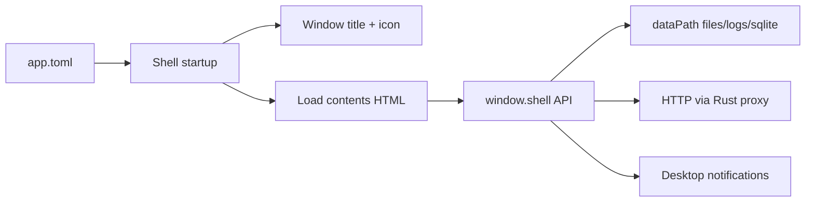

# app-ly documentation

## Overview

`app-ly` is a generic Tauri shell. One binary loads different apps by configuration instead of hard-coding UI in the Rust project.



## Configuration

Create an `app.toml`:

```toml
icon = "icon.png"
name = "My App"
contents = "contents/index.html"
dataPath = "data"
```

All paths are relative to the directory containing `app.toml`.

### Dev vs release

| Setting | Dev (`tauri dev`) | Release (`tauri build`) |
|---------|-------------------|-------------------------|
| Config source | `./app.toml` or `--config` | Bundled `$RESOURCE/app.toml` |
| Contents/icon | Resolved from config dir | Resolved from bundled resources |
| Data writes | `<config-dir>/<dataPath>` | `<app-data-dir>/<dataPath>` |

## Creating a new app identity

1. Add your HTML app under a folder, e.g. `myapp/contents/`
2. Add an icon, e.g. `myapp/icon.png`
3. Create `myapp/app.toml` or edit root `app.toml` for dev
4. For release, update [`bundle/app.toml`](../bundle/app.toml) and [`src-tauri/tauri.conf.json`](../src-tauri/tauri.conf.json) resources
5. Use `window.shell` in your HTML — see [`js-api.md`](js-api.md)

## Example

The included example is configured in [`app.toml`](../app.toml):

- Contents: [`example/contents/index.html`](../example/contents/index.html)
- Data: `example/data/` (created at runtime)
- Demo actions: save/load file, log, notify, HTTP fetch

Run:

```bash
npm run tauri dev
```

## Project layout

```
app-ly/
├── app.toml              # dev config
├── bundle/app.toml       # bundled release config
├── example/contents/     # sample HTML app
├── src-tauri/            # Rust shell
└── _docs/                # documentation
```