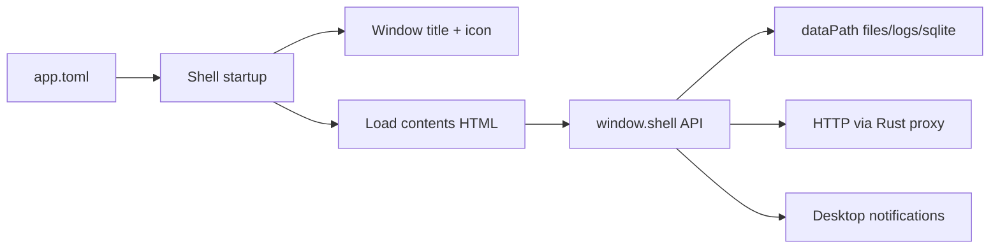

# app-ly documentation

## Overview

`app-ly` is a generic Tauri shell. One binary loads different apps by configuration instead of hard-coding UI in the Rust project.


```mermaid
flowchart LR
  toml[app.toml] --> rust[Shell startup]
  rust --> window[Window title + icon]
  rust --> html[Load contents HTML]
  html --> api[window.shell API]
  api --> data[dataPath files/logs/sqlite]
  api --> http[HTTP via Rust proxy]
  api --> notify[Desktop notifications]
```

## Configuration

Create an `app.toml`:

```toml
icon = "icon.png"
name = "My App"
contents = "contents"
dataPath = "data"
```

All paths are relative to the directory containing `app.toml`. `contents` (UI) and `dataPath` (writable data) are independent of each other.

Optional `[[allowedCommands]]` entries declare which local programs the contents HTML may start
via `shell.run` / `shell.spawn` — nothing runs unless it is listed there, and `program`, `cwd`,
and `env` come from this file only. See [`js-api.md`](js-api.md) for the full schema and
argument-matching rules. `timeoutMs` here is a default — a spawned process's deadline can be changed at runtime with `proc.setTimeout(ms)`.

```toml
[[allowedCommands]]
name = "git"
program = "git"
args = ["^(status|log|diff)$"]
timeoutMs = 30000
```

An optional `[ai]` table configures the on-device AI available to contents HTML as `shell.ai`.
The whole table is optional — absent means "all defaults, feature on" — and unknown keys are
ignored. Per-request options passed to `shell.ai.*` override every one of these. See
[`ai.md`](ai.md) for the full reference, including platform requirements and the availability
reason codes.

```toml
[ai]
enabled = true                                      # optional, default true. false => reason "disabled-by-config"
instructions = "Answer briefly and in plain text."  # optional. Default system prompt for every request
temperature = 0.7                                   # optional. Default sampling temperature
maxTokens = 512                                     # optional. Default cap on response length
toolTimeoutMs = 30000                               # optional, default 30000. How long the shell waits for a
                                                    # JS tool handler before answering the model with an error
```

An optional `[webdriver]` table turns on an in-process W3C WebDriver endpoint for controlling and
debugging a running app (Selenium, WebdriverIO, plain `curl`). It's off by default, and loopback-only
by default when on; `--webdriver`, `--webdriver-port`, `--webdriver-host`, `--webdriver-token`, and
`--no-webdriver` CLI flags override this table. See [`webdriver.md`](webdriver.md) for the full
reference, including auth, sessions, and the implemented command set.

```toml
[webdriver]
enabled = true        # optional; a present [webdriver] table means on unless this is false
host = "127.0.0.1"    # optional; default "127.0.0.1"
port = 4444           # optional; default 4444
token = "s3cret"      # optional; when set, requests must carry it
```

### Dev vs release

| Setting | Dev (`tauri dev`) | Release (`tauri build`) |
|---------|-------------------|-------------------------|
| Config source | `./app.toml` or `--config` | Bundled `$RESOURCE/app.toml` |
| Contents/icon | Resolved from config dir | Resolved from bundled resources |
| Data writes | `<config-dir>/<dataPath>` | `<config-dir>/<dataPath>` |

## Creating a new app identity

1. Add your HTML app under a folder, e.g. `myapp/contents/`
2. Add an icon, e.g. `myapp/icon.png`
3. Create `myapp/app.toml` or edit root `app.toml` for dev
4. For release, update [`bundle/app.toml`](../bundle/app.toml) and [`src-tauri/tauri.conf.json`](../src-tauri/tauri.conf.json) resources
5. Use `window.shell` in your HTML — see [`js-api.md`](js-api.md)

## Example

The included example is configured in [`app.toml`](../app.toml):

- Contents: [`example/contents/index.html`](../example/contents/index.html)
- Data: `example/data/` (created at runtime)
- Demo actions: save/load file, log, notify, HTTP fetch

Run:

```bash
npm run tauri dev
```

## Project layout

```
app-ly/
├── app.toml              # dev config
├── bundle/app.toml       # bundled release config
├── example/contents/     # sample HTML app
├── src-tauri/            # Rust shell
└── _docs/                # documentation
```

For the full repo layout, per-file module responsibilities, and the checklist for adding a new
`window.shell` method, see [`project-structure.md`](project-structure.md). For on-device AI
(`shell.ai`), see [`ai.md`](ai.md). For the WebDriver endpoint, see [`webdriver.md`](webdriver.md).