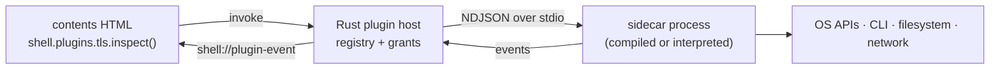

# Runtime plugins — exploration

How `app-ly` could gain a plugin system where **adding a capability does not mean rebuilding the
Rust binary**: a plugin is dropped next to `app.toml`, declared in config, and shows up in the
page as a JS API. Plugins may be compiled or interpreted, and must be able to touch things the
shell has no code for — CLI tools, the filesystem outside `dataPath`, and OS APIs.

This is a design exploration, not a shipped feature. A working prototype lives in
[`example/plugins/`](../example/plugins/) and runs on today's binary with no Rust changes — see
[Prototype](#prototype) at the end.

---

## 1. The constraint that decides everything

Three requirements were put on the table:

1. expose JS APIs to contents HTML,
2. interact with CLI and filesystem tools,
3. interact with OS APIs.

Requirement 3 is the hard one. "Call an OS API the shell was not compiled against" means the
plugin contains **native code the shell did not build**. There are exactly three ways to run
native code you did not compile: load it into your address space (dynamic library), run it in a
sandbox (WASM — which then *cannot* reach OS APIs without host support), or run it in another
process. Everything below follows from that fork.

Requirements 1 and 2 are comparatively easy and are satisfied by all candidates.

---

## 2. What the shell already has

Worth taking inventory first, because most of the plumbing exists:

| Existing piece | What it already gives a plugin system |
|---|---|
| [`process.rs`](../src-tauri/src/process.rs) — `shell.run` / `shell.spawn` | Child processes with piped stdio, live stdin writes, re-armable timeouts, kill/reap, exit events |
| `[[allowedCommands]]` in [`config.rs`](../src-tauri/src/config.rs) | The precedent for *config, not JS, holds authority*: `program`, `cwd`, `env` can only come from `app.toml` |
| [`ai.rs`](../src-tauri/src/ai.rs) tool bridge | The exact request/response correlation pattern a plugin host needs: a `pending` map keyed by a random call id, an `emit_to("main", …)` out, and a `shell_ai_tool_result` command back in |
| `shell://` protocol + `initialization_script` in [`lib.rs`](../src-tauri/src/lib.rs) | A place to inject plugin-provided JS shims before page scripts run |
| [`server.rs`](../src-tauri/src/server.rs) | An HTTP/WS transport already in the binary, if a plugin should be reachable over a socket instead of stdio |
| `permissions/shell.toml` ACL | Per-command gating, already enforced |

The honest observation: **`[[allowedCommands]]` + `shell.spawn` is already a runtime plugin
system, just without a protocol, a manifest, a lifecycle, or a name.** The prototype in
`example/plugins/` is nothing but those two features plus ~180 lines of JS. That matters for
sequencing — the first version of this feature is mostly formalisation, not new machinery.

---

## 3. Candidate runtimes

### A. In-page JS modules (tier 0)

A plugin is an ES module under `contents/`, loaded with `import()`. Zero shell work.

- **Yes:** trivially hot-reloadable, no protocol, full DOM access.
- **No:** a plugin has exactly the powers the page already has — no OS APIs, no filesystem beyond
  `dataPath`, no CLI unless already allowlisted. It cannot satisfy requirement 3 at all.
- **Verdict:** useful for UI-level extensions, not a plugin *runtime*. Keep it as the free tier.

### B. Sidecar process, any language (recommended default)

A plugin is an executable — a compiled Rust/Go/Swift binary, or a script run by `node`/`python3`
— speaking newline-delimited JSON over stdin/stdout.



- **Yes:** any language, compiled *or* interpreted, ships as an ordinary file, full OS access, a
  crash or a leak or an `abort()` cannot take the shell down, killable and timeout-able,
  debuggable on its own (`node main.mjs < script.jsonl`), and the transport already exists in
  `process.rs`.
- **No:** process-per-plugin memory and startup cost (~30 ms for a small native binary, ~40–80 ms
  for a Node script), serialisation overhead on every call, no shared memory for large payloads,
  and — the big one — **no sandbox**: the sidecar runs as the user, with the user's privileges.
  Distribution is per-platform if the plugin is compiled.
- **Verdict:** the best fit for the three stated requirements. This is what MCP, LSP, and
  Tauri's own `sidecar` do, for the same reasons.

### C. WebAssembly (wasmtime, or Extism as a ready-made plugin layer)

A plugin is a `.wasm` file, loaded into the shell process and run in a sandbox.

- **Yes:** genuinely sandboxed (memory-safe, no ambient authority), one artefact for every
  platform, near-native compute speed, deterministic resource limits (fuel, memory caps),
  restartable in microseconds. Extism gives the manifest/host-function layer for free.
- **No:** **it cannot call OS APIs.** WASM has no syscalls; everything it can do, the host must
  hand it as an imported host function. WASI gets you files/clock/sockets and nothing else — no
  Keychain, no Security.framework, no DBus, no COM. Compiling an existing native library to WASM
  is often not possible. Adds ~5–8 MB and a large dependency tree to the binary.
- **Verdict:** excellent for *pure-compute* plugins from untrusted sources (parsers, formatters,
  rules engines, transforms). Structurally unable to satisfy requirement 3. Complement, not
  replacement.

### D. Native dynamic library (`.dylib` / `.so` / `.dll`)

A plugin is a shared library the shell `dlopen`s, exporting a stable C ABI.

```rust
// The vtable a plugin exports. Versioned, C ABI, no Rust types across the boundary.
#[repr(C)]
pub struct PluginVTable {
    pub abi_version: u32,                       // host refuses a mismatch
    pub describe: extern "C" fn() -> *const c_char,
    pub call: extern "C" fn(
        method: *const c_char,
        params_json: *const c_char,
        out_json: *mut *mut c_char,             // plugin allocates
    ) -> i32,
    pub free: extern "C" fn(*mut c_char),       // …and frees, with its own allocator
}

#[no_mangle]
pub extern "C" fn app_ly_plugin_v1() -> *const PluginVTable { /* … */ }
```

- **Yes:** full OS API access, no IPC or serialisation cost beyond the JSON string (or none, with
  a richer ABI), can share memory for big buffers, single-digit-microsecond calls.
- **No:** a plugin bug is a shell crash — no fault isolation, no memory safety, no way to enforce
  a timeout on a wedged call. Every `dlopen` is `unsafe`. ABI drift is a permanent tax (Rust has
  no stable ABI, so `repr(C)` everywhere and never pass `String`/`Vec`/trait objects). Per-platform
  builds. On macOS, loading an unsigned library into a hardened-runtime app needs the
  `disable-library-validation` entitlement — which materially weakens the app's own security
  posture and complicates notarisation.
- **Verdict:** the escape hatch for deep, latency-sensitive OS integration from *trusted*
  first-party plugins. Should never be the default tier, and should be off unless config opts in.

### E. Embedded interpreter (Rhai, mlua, QuickJS, Boa, Deno core)

Ship a script engine inside the binary; plugins are `.rhai` / `.lua` / `.js` files.

- **Yes:** hot-reload, tiny plugins, one artefact for all platforms, safe by default (the engine
  exposes only what you register), great for glue and config-like logic. Rhai in particular is
  ~1 MB and pure Rust.
- **No:** the plugin's power is *exactly* the set of host functions you compiled in — so adding a
  new OS capability still means rebuilding the shell, which is the thing this exercise is trying
  to avoid. Deno core drags in V8 (~40 MB, long build). Every engine is a new supply-chain and
  sandbox-escape surface.
- **Verdict:** solves interpretation, not extensibility. It moves the recompile from "per
  feature" to "per capability", which is a smaller win than it first appears. Skip unless
  scripting the *app* (not the shell) becomes a goal.

### Comparison

| | A. In-page JS | B. Sidecar | C. WASM | D. Native dylib | E. Interpreter |
|---|---|---|---|---|---|
| No shell rebuild to add a plugin | ✅ | ✅ | ✅ | ✅ | ✅ …but new capabilities need one |
| Reach arbitrary OS APIs | ❌ | ✅ | ❌ | ✅ | ❌ |
| Run CLI / touch the filesystem | ❌ | ✅ | ⚠️ WASI only | ✅ | ⚠️ if host-exposed |
| Compiled *and* interpreted plugins | ❌ | ✅ both | ⚠️ compiled to wasm | ❌ compiled | ❌ interpreted |
| Crash isolation | ✅ | ✅ | ✅ | ❌ | ⚠️ |
| Real sandbox | ⚠️ webview | ❌ | ✅ | ❌ | ⚠️ |
| Enforceable timeout / kill | ⚠️ | ✅ | ✅ | ❌ | ⚠️ |
| One artefact per platform | ✅ | ❌ if compiled | ✅ | ❌ | ✅ |
| Per-call cost | ~0 | ~0.1–1 ms | ~µs | ~µs | ~µs |
| Added binary size | 0 | 0 | ~5–8 MB | ~0 | 1–40 MB |
| Work to first version | none | **small** | medium | medium | medium |

---

## 4. Recommendation

**Tiered, with sidecars as the default and only tier 1.**

- **Tier 0 — JS modules.** Already possible; document it, don't build it.
- **Tier 1 — sidecar processes.** Build this. It is the only option that satisfies all three
  requirements at once, it reuses `process.rs` almost entirely, and it accepts compiled *and*
  interpreted plugins with no per-language work in the shell.
- **Tier 2 — WASM (Extism), behind a Cargo feature.** Add when untrusted third-party plugins
  become a real scenario. Same manifest, same JS surface, different `kind`.
- **Tier 3 — native dylib, behind a Cargo feature and an explicit config opt-in.** Add only if a
  measured latency or API-shape problem proves the sidecar boundary is the bottleneck.

The manifest, the config schema, the capability model, and the JS API are **shared across tiers**
— `kind = "sidecar" | "wasm" | "native"` is the only thing that changes. That is what keeps tier 2
and 3 cheap later, and it is the part worth getting right now.

---

## 5. Proposed design

### 5.1 Config — `app.toml`

Follows the `[[allowedCommands]]` precedent exactly: the app author, not the plugin author, holds
authority. Nothing loads unless it is listed here.

```toml
[[plugins]]
name = "tls"                       # required; JS namespace, must be unique
path = "plugins/tls-inspect"       # required; folder with plugin.toml, relative to app.toml
enabled = true                     # optional, default true
autostart = false                  # optional; default false = start on first call
grants = ["net", "fs:read:/etc/ssl"]  # optional; capabilities actually granted (see 5.5)
timeoutMs = 15000                  # optional; default per-call deadline
idleStopMs = 60000                 # optional; stop after this long unused (cf. db.rs's 30s)
env = { NODE_ENV = "production" }  # optional; merged over the inherited environment
```

### 5.2 Manifest — `plugin.toml`, next to the plugin

What the *plugin* declares about itself. Parsed by the existing `toml` crate in Rust. Unknown
keys ignored, so a newer plugin stays loadable by an older shell.

```toml
name = "tls"
title = "TLS certificate inspector"
apiVersion = 1                     # protocol version the plugin speaks
kind = "sidecar"                   # sidecar | wasm | native

[sidecar]
command = "node"                   # bare name (PATH) or path relative to the plugin folder
entry = "main.mjs"
args = []

capabilities = ["net"]             # what it *asks* for; app.toml decides what it gets
clientScript = "client.js"         # optional; injected into the page, see 5.4
```

Two files, deliberately. `app.toml` says *whether and with what*; `plugin.toml` says *what it is
and how to start it*. Merging them would put the plugin author in charge of their own grants.

### 5.3 Wire protocol v1 (sidecar)

One JSON object per line, UTF-8, `\n`-terminated. **stdout carries protocol traffic only**;
anything the plugin wants to log goes to stderr and is surfaced as a `stderr` event. NDJSON is
chosen over LSP-style `Content-Length` framing because `process.rs` already delivers stdout as
UTF-8 string chunks; revisit if binary payloads are ever needed.

```jsonc
// host → plugin
{"v":1,"id":"7","method":"inspect","params":{"host":"example.com"}}
// plugin → host, success / failure
{"v":1,"id":"7","ok":true,"result":{"chain":[…]}}
{"v":1,"id":"7","ok":false,"error":{"message":"getaddrinfo ENOTFOUND","code":"dns"}}
// plugin → host, unsolicited event (no id)
{"v":1,"event":"progress","data":{"done":1,"total":3}}
```

Reserved methods, all `$`-prefixed so they can never collide with a plugin's own:

| Method | Purpose |
|---|---|
| `$describe` | Handshake. Returns `{ name, apiVersion, methods: [{ name, description, params }] }` — the source of truth for the generated JS proxy |
| `$cancel` | `{ id }` — abandon an in-flight call |
| `$shutdown` | Exit cleanly; the host kills after a grace period |

Calls are concurrent and correlated by `id` — the same shape as `ai.rs`'s `pending_tools` map.
The framing is symmetric, so **host functions** are the same messages in the other direction: a
plugin may send `{"v":1,"id":"h1","method":"host.log","params":{…}}` and the host replies in the
same format, gated by that plugin's grants. That is how a sidecar gets at `dataPath`,
notifications, or the keychain without re-implementing them.

### 5.4 JS surface

```js
// Discovery
await shell.plugins.list();
// [{ name: "tls", title: "TLS certificate inspector", running: false, kind: "sidecar",
//    methods: [{ name: "inspect", description: "…" }], grants: ["net"] }]

// Direct call — starts the plugin on first use
await shell.plugins.call("tls", "inspect", { host: "example.com" });

// Handle, with a proxy generated from $describe
const tls = await shell.plugins.open("tls");
await tls.inspect({ host: "example.com" });
const off = tls.on("progress", (data) => render(data));
await tls.stop();

// Namespaced sugar, for plugins the app treats as first-class
await shell.plugins.tls.inspect({ host: "example.com" });
```

`clientScript` is the ergonomic escape hatch: a plugin ships a JS file, the shell appends it to
the `initialization_script` (alongside `shell-api.js` and `shell-shortcuts.js`), and the plugin
author gets to define the API *shape* the page sees — validation, defaults, typed wrappers,
convenience methods — instead of being stuck with generic `call(method, params)`. It runs in the
page, with the page's privileges, so it grants nothing; it is sugar over the same bridge.

### 5.5 Capabilities and grants

The manifest *asks*; `app.toml` *grants*; the host *enforces what it can*. Being precise about
that last clause matters:

| Capability | Enforced where, for a sidecar |
|---|---|
| `net` | **Not enforced.** The process has the user's network access |
| `fs:read:<path>` | **Not enforced** by the host |
| `run:<program>` | **Not enforced** by the host |
| `host.<method>` | **Enforced.** Host functions are checked against grants on every call |

For a sidecar, grants are *declaration and audit*, not a sandbox — see §6. Real enforcement is
available and should be used where the platform offers it: seatbelt/`sandbox-exec` on macOS,
namespaces/seccomp on Linux, AppContainer on Windows, or simply the WASM tier where all four
rows become enforced. Recording the grant model now is what makes tier 2 a drop-in later.

### 5.6 Rust module layout

Mirrors how `ai.rs` splits a generic front end from swappable backends:

```
src-tauri/src/
├── plugins.rs              # registry, manifest parsing, grants, the #[tauri::command] handlers
└── plugins/
    ├── protocol.rs         # wire types, framing, the pending-call map
    ├── sidecar.rs          # tier 1: process transport over process.rs machinery
    ├── wasm.rs             # tier 2, behind the `plugins-wasm` feature
    └── native.rs           # tier 3, behind the `plugins-native` feature
```

```rust
/// One loaded plugin. `Transport` is the tier-specific half.
pub struct Plugin {
    manifest: PluginManifest,
    config: PluginEntry,          // the [[plugins]] entry that admitted it
    transport: Box<dyn Transport>,
    pending: PendingCalls,        // call id -> oneshot sender; cf. ai.rs
    describe: Option<Describe>,
}

pub trait Transport: Send + Sync {
    fn start(&mut self, app: &AppHandle) -> Result<(), String>;
    fn send(&self, message: Request) -> Result<(), String>;
    fn stop(&mut self);
    fn running(&self) -> bool;
}
```

New invoke handlers — `shell_plugin_list`, `shell_plugin_call`, `shell_plugin_cancel`,
`shell_plugin_start`, `shell_plugin_stop` — plus a `shell://plugin-event` event channel. Each one
goes through the four-step checklist in
[`project-structure.md`](project-structure.md#adding-a-new-windowshell-method): handler → 
`generate_handler!` → `permissions/shell.toml` → `shell-api.js`.

### 5.7 Lifecycle

- **Lazy start** on first call (`autostart = true` opts into eager start), so an unused plugin
  costs nothing.
- **Handshake** with `$describe` before the first user call resolves; a plugin whose `apiVersion`
  the host does not speak is rejected with a clear message rather than half-loaded.
- **Idle stop** after `idleStopMs`, following the connection cache in `db.rs`.
- **Crash handling**: pending calls reject with the exit code; the next call restarts the plugin.
  A crash loop (N restarts in M seconds) disables the plugin and surfaces the reason in
  `shell.plugins.list()`.
- **Shutdown**: `$shutdown`, then kill after a grace period. Nothing is left orphaned when the
  window closes.

---

## 6. Security

This is where a plugin system earns or loses its keep, so state it plainly rather than in
capability jargon:

**A sidecar plugin runs as the user, with the user's full privileges.** It can read any file the
user can read, open any socket, spawn any program, and phone home. Everything `[[allowedCommands]]`
was carefully designed to prevent — the webview picking `program`, `cwd`, or `env` — is
reintroduced the moment one plugin is admitted, because the plugin's *own* code chooses those
freely. The prototype makes this vivid: `os-trust` shells out to `security(1)` and reads
`/etc/ssl/certs/`, and nothing in the shell mediated either.

Consequences for the design:

1. **Installing a plugin is a trust decision equivalent to installing an application.** The UI
   and docs must say so; there is no honest way to present a sidecar plugin as "sandboxed".
2. **Authority stays in `app.toml`.** The webview must never name a path, program, or plugin that
   is not already declared. A page compromised by injected content should gain nothing beyond the
   plugin methods the app author already admitted.
3. **The plugin folder is part of the app's integrity surface.** Anyone who can write to it can
   run code as the user, next time the app starts. On macOS a plugin folder beside the `.app` is
   as writable as `app.toml` — worth a signed-manifest / checksum-pinning option
   (`sha256 = "…"` in the `[[plugins]]` entry) before third-party distribution.
4. **Prefer the WASM tier for anything third-party.** That is the whole reason to keep `kind` in
   the manifest from day one.
5. **Log every plugin start** — name, resolved program, argv, grants — through `shell.log`, so an
   app that misbehaves leaves a trail in `dataPath/logs`.

---

## 7. Worked example: TLS certificates

"Explore TLS certificates" turns out to be an unusually good test case, because it needs all three
requirement classes and lands on a real gap in the shell.

**What the shell can do today:** nothing. There is no certificate API, and `shell.fetch` builds a
plain `reqwest::Client` compiled with `rustls-tls`, whose roots come from **`webpki-roots`** — a
baked-in Mozilla bundle. It does not consult the OS trust store. So a corporate MITM proxy, a
private enterprise CA, or a locally trusted development certificate causes `shell.fetch` to fail
with a bare "request failed", while the same URL works in every browser on the machine. (Running
the prototype through this sandbox's egress proxy shows exactly that chain: a leaf issued by an
internal gateway CA that `webpki-roots` has never heard of.)

**What a plugin unlocks, with no shell rebuild:**

| Capability | How | Tier |
|---|---|---|
| Inspect a server's chain — subjects, SANs, validity, fingerprints, protocol, cipher | `tls.connect` in Node, or `rustls` + `x509-parser` in a compiled sidecar | sidecar |
| Expiry monitoring / dashboards across many hosts | Loop + `progress` events | sidecar |
| Diagnose *why* verification failed (expired, self-signed, wrong host, unknown CA) | Connect with verification off and report, instead of failing opaquely | sidecar |
| Read the OS trust store | macOS `security(1)` or Security.framework; Linux `/etc/ssl/certs`; Windows `certutil` / `CertOpenSystemStore` | sidecar or native |
| Parse and validate a chain offline (PEM/DER in, JSON out) | Pure compute, no ambient authority needed | **wasm** |
| Client certificates / mTLS, custom CAs for `shell.fetch` | Needs the shell's own HTTP client to change | ⚠️ not a plugin — see below |
| Keychain-backed client identity, code-signing checks | Security.framework / CryptoAPI directly | native |

The last two rows are the interesting boundary. A plugin can *tell you* your fetch will fail; it
cannot *fix* `shell.fetch`, because trust roots are chosen when the `reqwest` client is built
inside the binary. Two separate follow-ups fall out of that, both independent of plugins:

- switch `reqwest` to `rustls-tls-native-roots` (or add a config-level `caBundle` /
  `extraCaCerts` key) so the OS trust store and corporate CAs work;
- report TLS failures from `shell_fetch` with the underlying rustls error instead of collapsing
  to "request failed".

The plugin system's job here is *observation and diagnosis*, and it does that fully. Configuring
the shell's own trust is a shell concern, and pretending a plugin could take it over would be the
design mistake to avoid.

---

## 8. Worked example: OS APIs exposed to JS

The general shape, in three tiers, for "the page wants something only the OS can answer":

**Sidecar (works today).** `example/plugins/os-trust/` returns platform facts from Node's `os`
module, selected environment variables, and trust anchors parsed out of the platform store — three
different mechanisms (an OS API, a CLI tool, and the filesystem) behind one JS call. Adding a
method is editing one `.mjs` file; nothing recompiles.

**Compiled sidecar.** The same protocol, but the executable is a Rust or Swift binary linked
against the platform SDK — the way to reach Security.framework, EventKit, WinRT, or DBus without
touching the shell. Distribution becomes per-platform; the shell's side of it does not change at
all, which is precisely the point of putting the protocol at the process boundary.

**Native dylib (tier 3).** Same OS reach with per-call cost in microseconds instead of
milliseconds, paid for with fault isolation and the macOS library-validation entitlement. Justified
only by a measured need — a high-frequency API, a callback-heavy OS event stream, or a handle that
cannot cross a process boundary.

A rule of thumb for the boundary: if a call happens on user action, a sidecar's ~0.1–1 ms is
invisible. If it happens per frame or per event in a stream, it is not.

---

## 9. Prototype

[`example/plugins/`](../example/plugins/) is a working implementation of tier 1 with the host in
JavaScript instead of Rust — enough to validate the protocol, the lifecycle, and the ergonomics
before writing any Rust.

```
example/plugins/
├── app.toml            # runnable config; allowlists `node` on a .mjs under this folder
├── index.html          # demo UI
├── plugin-host.js      # the host: discovery, spawn, NDJSON framing, correlation, events
├── sidecar-sdk.mjs     # ~60-line plugin-side runtime (framing, dispatch, $describe/$cancel)
├── tls-inspect/        # plugin: certificate chain, expiry, bulk check with progress events
└── os-trust/           # plugin: platform facts, env, OS trust anchors
```

```bash
npm run tauri dev -- --config ./example/plugins/app.toml
```

The whole plugin surface rests on a single grant:

```toml
[[allowedCommands]]
name = "node"
program = "node"
args = ["^[\\w.-]+/[\\w.-]+\\.mjs$"]
```

**What it proves.** Sidecar plugins work on today's binary. `shell.spawn`'s stdio is a sufficient
transport, including partial-line chunking and concurrent in-flight calls. A `$describe`
handshake is enough to generate a usable JS proxy. Events (`progress`) and per-call timeouts with
`$cancel` behave. Both example plugins reach things the shell has no code for — TLS chains, a CLI
tool, files outside `dataPath`, OS APIs.

**What it fakes,** and what moving the host into Rust would fix:

| Prototype | Rust host |
|---|---|
| Manifests fetched over `shell://`, so plugins must live inside `contents` | Read from disk; plugins live anywhere, out of the UI tree |
| `plugin.json` (the webview has no TOML parser) | `plugin.toml`, via the `toml` crate already in the tree |
| Any page script can reach `window.plugins` and spawn any allowlisted `.mjs` | Registry and grants enforced in Rust; the page names a plugin, never a program |
| No grants, no idle stop, no restart policy, no crash-loop backoff | All of §5.5 and §5.7 |
| Host functions (plugin → shell) unimplemented | Symmetric protocol, gated by grants |

---

## 10. Cost and sequencing

| Step | Scope | Rough effort |
|---|---|---|
| 1. Protocol + manifest + registry, sidecar transport, `shell.plugins` JS surface, docs | `plugins.rs`, `plugins/protocol.rs`, `plugins/sidecar.rs`, `shell-api.js`, ACL | ~2–3 days |
| 2. Lifecycle hardening: idle stop, crash-loop backoff, `$cancel`, host functions, logging | Same files | ~1 day |
| 3. `clientScript` injection | `lib.rs` init-script assembly | ~2 hours |
| 4. WASM tier via Extism, behind `plugins-wasm` | `plugins/wasm.rs`, `Cargo.toml` | ~2 days |
| 5. Native tier, behind `plugins-native` + config opt-in | `plugins/native.rs`, entitlements | ~2 days, ongoing ABI cost |
| — | Independent of plugins: native TLS roots + better fetch errors | ~2 hours |

Steps 1–3 deliver the whole stated requirement set. Steps 4 and 5 are demand-driven.

---

## 11. Open questions

1. **Do plugins ship UI?** A plugin contributing HTML panels or menu items is a much larger
   design (asset serving over `shell://`, CSS isolation, a menu contribution model). Deliberately
   excluded above; worth deciding before the manifest format ossifies.
2. **Discovery vs. declaration.** Should the shell scan a `plugins/` folder and offer what it
   finds, or only load what `app.toml` names? Declaration-only is safer and matches
   `[[allowedCommands]]`; scanning is friendlier. A middle path: scan for *listing*, load only
   what is declared.
3. **Where do plugins live in a deployed app?** Beside `app.toml` (writable, user-installable) or
   inside the bundle (signed, read-only)? This decides whether checksum pinning is optional.
4. **Binary payloads.** NDJSON forces base64 for certificates, images, and archives. Acceptable
   now; if not, `Content-Length` framing or a side channel over the existing `server.rs`.
5. **Per-plugin sandboxing.** Is `sandbox-exec`/seccomp worth wiring for the sidecar tier, or is
   WASM the answer for anything that needs real confinement?
